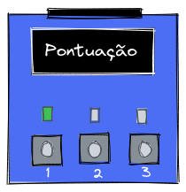
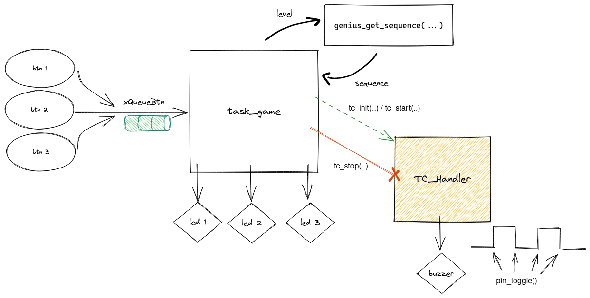

# 22b - AV3 - Genius

Nesta avaliação vocês irão recriar o jogo Genius (Simon), só que com 3 botões no lugar de 4.


## Descrição

Periféricos:

- PIO
- TC
- OLED

freeRTOS:

- Task
- Queue

### Genius

O jogo consiste em decorar e reproduzir uma sequência que é apresentada de forma visual e a cada nível a sequência fica maior. O jogo continua até o jogador errar a ordem.

[](https://www.youtube.com/embed/NuTTUBVw2sE)


### Funcionalidades

Para implementarmos o protótipo do jogo, iremos usar a placa OLED (LEDs e botões):



Para cada LED / botão apertado o jogo deve tocar uma frequência específica no buzzer, o som deve ser reproduzido enquanto o LED estiver aceso. O OLED irá exibir o nível atual do jogo e também uma mensagem de erro se o jogador errar e acabar o jogo. **O fim de jogo** deve acontecer quando o jogador:

1. Apertar um botão enquanto a sequência ainda está sendo exibida
1. Errar a ordem
1. Se o jogador não apertar um botão em 800ms deve dar erro
1. Apertar um botão a mais

Se o jogador fizer a sequência correta, o jogo deve partir para a próxima fase (incremental: 0, 1, 2, 3 ...).

### Firmware

Vocês devem desenvolver o firmware como indicado a seguir:



**O código base fornecido é o `RTOS-OLED-Xplained-Pro` já com o RTT e TC adicionado no wizard.**

Onde:

- Botões
  - devem ser configurados para funcionar com `callback`
  - devem enviar o ID `int` para a fila `xQueueBtn` 

- LEDs
  - Exibem a sequência a ser seguida
  
- OLED
  - Exibe o nível **atual** e **FIM DE JOGO** quando acabar

- Buzzer
  - Uma frequência por botão: `[1000 1500 2000]`
  - Vibrar enquanto o LED estiver aceso
  - Usar algum timer para vibrar (TC ou RTT)

- `task_game`
  - **Já foi criada!**
  - Responsável por implementar toda a lógica do jogo
  - Lê os botões do usuário via `xQueueBtn`
  - Aciona os LEDs 
  - Controla o TC para fazer o buzzer vibrar
  
- `TC1_Handler`
  - Vibrar buzzer na frequência definida para cada LED 

- `int genius_get_sequence(int level, int *sequence)`
  - **Já foi dada pronta, mas é necessário analisar para entender**
  - Função que deve ser utilizada para definir a sequência dos LEDs de acordo com o nível atingido pelo jogador
  - `return int`: Tamanho da sequência 
  - `int level`: nível de `0` até `511`
  - `int *sequence`: Deve ser um endereço de memória de um vetor, onde a sequência será salva.

### Dicas

Uso do `genius_get_sequence()`:

``` c
int nSequence = 0;
int sequence[512];
int level = 0;
nSequence = genius_get_sequence(level, sequence);
```

Passos:

1. Crie a `task_game` e usando a função `genius_get_sequence` crie uma sequência (com a função `genius_get_sequence`) e exiba nos LEDs a sequência
    - Lembre de configurar os botões (`xQueueBtn`) e LEDs
    - Eu testei aqui e o led aceso por `100ms` funciona bem.
1. Usando o TC faça o buzzer vibrar na frequência associada ao LED aceso 
    - Você vai precisar usar o `TC_init` e `tc_start` para começar a tocar o som e `tc_stop` para parar!
    - O buzzer tem que vibrar no `TC Handler`
    - Use o `pin_toggle` dentro do handler, isso fará o buzzer tocar!
1. Exiba no OLED o nível atual
1. Comece a ler a fila `xQueueBtn` e implemente a lógica do jogo
    - Falhar quando um botão foi apertado e a sequência ainda estava sendo exibida
    - Verificar sequência correta
    - Timeout do botão
1. Não esqueça do `timeout` do botão
     - Eu usei `800ms
1. Exiba no OLED se o jogador errou ou se vai começar um nível novo
    - Dê um pouco de tempo para o jogador pensar entre um nível e outro 

Agora tudo deve estar funcionando, valide todos os requisitos.
